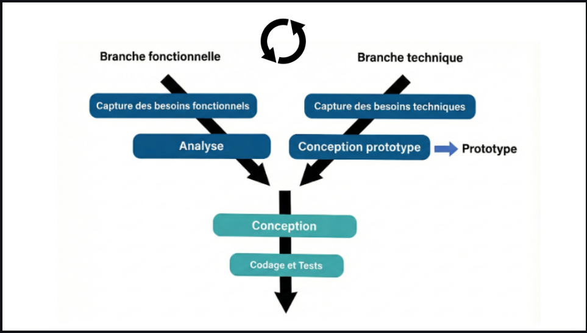
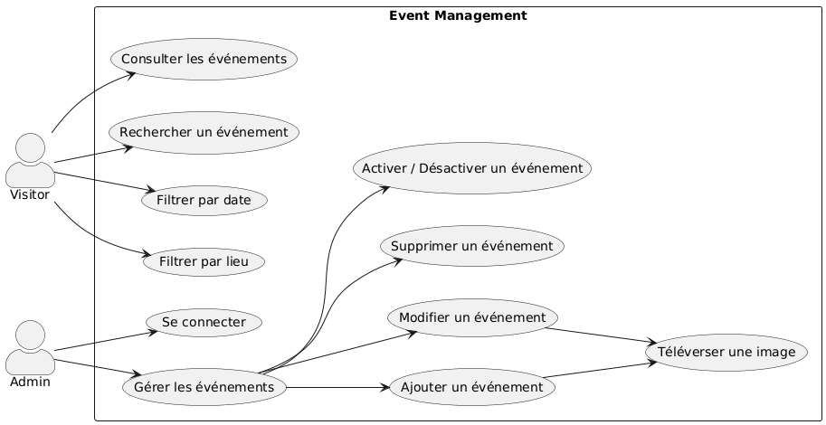
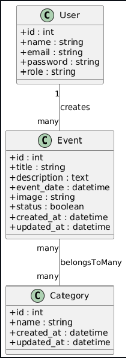

# **Présentation Projet-technique**
### Event Management App (Events, Categories)  
**Réalisé par :** AZIZ Soufiane  
**Encadré par :** M. ESSARRAJ Fouad

---

## La méthode Waterfall (En cascade)

---

## Travail à faire

### Développer l'Application Event Management
* **Partie Publique :**  
  Interface permettant aux visiteurs de consulter les événements.  
  Fonctionnalités : Recherche par titre, filtre par Categories, pagination (10 éléments/page).

* **Partie Admin :**  
  Tableau de bord sécurisé pour la gestion des événements.  
  Fonctionnalités : CRUD des événements, modales pour ajout/édition, AJAX pour les mises à jour asynchrones.

---

## Contexte

*   **Projet de Fin de Formation:** Travail réalisé dans le cadre du projet de fin de formation, en commençant par la branche technique.

*   **Processus 2TUP:** Le projet suit la méthodologie 2TUP (Processus de développement en Y), avec séparation des branches Fonctionnelle, Technique et Réalisation.
  
---

*   **Renforcement des Compétences:** Mise en pratique des compétences Laravel 12 sans outils d'IA, en s'appuyant sur les acquis précédents.

---

## Besoin - Analyse Technique

### Les technologies à utiliser

1. Exigences:e données :** MySQL  
2. **Framework :** Laravel 12  
3. **Architecture N-Tiers :**
   - **Controller :** Gestion des requêtes HTTP
   - **Service :** Logique métier liée aux événements
   - **Model :** Interaction avec la base de données
4. **Architecture :** MVC  
5. **Blade :** Templates réutilisables (layouts, components)
6. **AJAX :** Gestion dynamique des formulaires et statuts sans rechargement

---

7. **Téléchargement d'images :**  
   Upload d'affiches ou images liées aux événements.
8. **Support Multi-langue :**  
   Français et Anglais (fr, en).
9. **Vite :**  
   Outil de build rapide pour les assets.
10. **Preline UI :**  
    Composants UI modernes.
11. **Lucide Icons :**  
    Icônes légères et modernes.
12. **Tailwind CSS :**  
    Interface responsive et rapide à développer.

---

## Analyse: Analyse Fonctionnelle

---

## Conception

---

## Sujet - Live coding

* Bouton **"Ajouter un événement"** ouvrant une modale de création.
* Barre de recherche filtrant les événements par titre en temps réel.